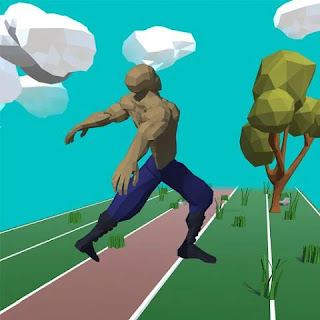

# Floppy Sprinter
Alternate between tapping the Right and Left buttons to control their steps.   
Be careful not to step with the same leg twice or with both legs together or you will trip over and flop!   
Keep your rhythm or sprint as fast as you can!   
With each tap step you can break new speeds and distances.

# ⬇️ [Download Floppy Sprinter for Android](https://apkcombo.com/floppy-sprinter/com.Graphluid.FloppySprinter/)
An infinite runner with an active rag-doll physics simulation, procedural animation twist. Floppy Sprinter is a game released to the Google Play Store in 2018 where it performed quite well. Earning a 5 star rating and approx. 100 downloads. Since then it has been taken down from the app store and it can be downloaded via various online .apk libraries for Android apps such as [APK Combo](https://apkcombo.com/floppy-sprinter/com.Graphluid.FloppySprinter/).
# 📝 Developer Comments
Over the development of this game, I was able to develop the ideas, concepts and mechanics behind active ragdoll physics, simulation driven, procedural animation. Going on to develop the Physicanim ~* Unity Asset Package to help other game developers around the world to solve the problem of rigid body animated characters and their interactions with physics objects in the environment.