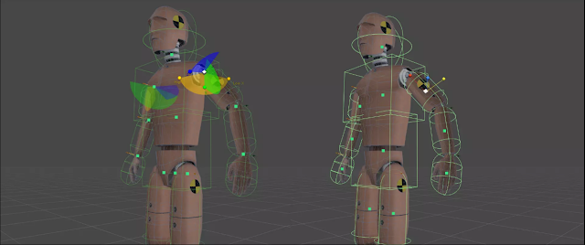
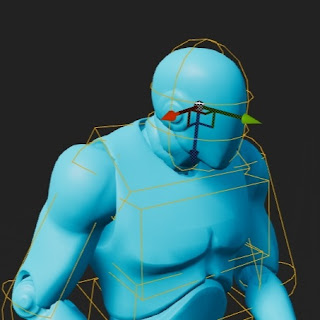

---
tags:
  - Physicanim
  - active
  - physics
  - procedural
  - animation
  - physics-driven
  - rigid
  - body
  - rag-doll
  - rag
  - doll
  - ragdoll
date:
---
# Physicanim ~*
This Unity asset package contains an active ragdoll toolkit for the Editor that allow you to convert any humanoid character animation to physics driven animations. Convert any rigged humanoid character into an advanced procedurally animated active rag-doll. *A.K.A* Physicanim Character ~\*. 

## Features
- **Physicanim Active Rag-doll Builder** - Create and convert character models into Physicanim active ragdoll characters in one click!
- **Basic Physicanim Character Behaviours** - Fall down, get back up.
- **Physicanim Character Controller**

# ⬇️ [Download Physicanim for Unity](https://github.com/TildeAsterisk/Physicanim)

## 🦿 Physicanim Character Behaviours
The Physicanim Character Behaviours class provides the active ragdoll a number of procedural behaviours to react to the standard situations. It is able to walk, run, jump, trip, fall and then get up.  
While falling, the Physicanim character tries to maintain a protective pose. When getting back up, the movement lock to the root of the static animator is slowly increased to transition from free falling to animation root motion control.

# 📝 Developer Comments
For many years I have been making games in Unity exploring ragdoll physics and procedural animation. Setting up an active ragdoll for every project can become very tedious, so I have  developed a Unity Package that will create your active ragdoll, set up its bones & joints and animate it in a way that is physically simulated with physics rigid body and collider components. The package is available install through the Unity Package Manager and on the [GitHub page](https://github.com/TildeAsterisk/Physicanim/releases/tag/v1.0.1).

