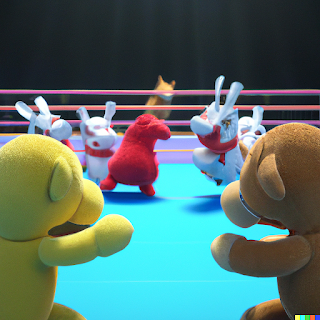

# Plushie Panic! - Beta (1.2.2)

  <iframe allowfullscreen="" frameborder="0" height="550" src="https://itch.io/embed-upload/6669817?color=333333" width="100%"><a href="https://tildeasterisk.itch.io/plushie-panic"
      >Play Plushie Panic! on itch.io</a
    ></iframe>

[CLICK THE BOX IN MIDDLE OF SCREEN TO EXPAND]

Your room is a complete mess! Clean up all the toys by putting them away in the toy box. Punching enemies in the head will knock out, once enemies are knocked out they are easier to grab them with both hands and carry them over to the toy box.
## 🎛️ Controls

|                        | Keyboard & Mouse   | Controller    |
| ---------------------- | ------------------ | ------------- |
| **Move**               | W, A, S, D         | Left Joystick |
| **Left Punch / Grab**  | Left Mouse Button  | West Button   |
| **Right Punch / Grab** | Right Mouse Button | East Button   |
| **Jump**               | Space Bar          | South Button  |
| **Restart Level**      | _                  | Pause Button  |

# 📝 Developer Comments
Plushie Panic! is a project that I worked on for a few months in mid 2020 along with two other developers. Initially the project was intended to be a multiplayer brawler, code named Toy Rumble. Making use of the [Physicanim ~\*](Physicanim) Active Rag-doll System results in a fun, dynamic and more interactive-feeling gameplay. The multiplayer development was halted, and I decided to make a single player demo in order to demonstrate the concept and the stage in the development process.

